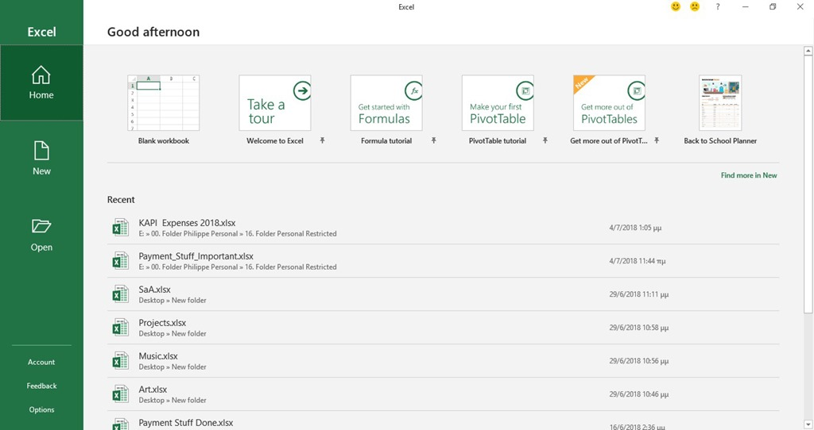
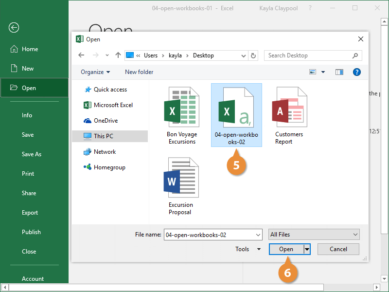
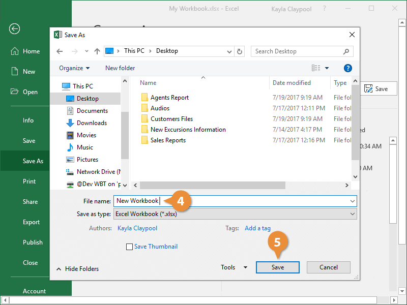

# Plan de Pruebas: Automatización de Interfaz de Excel

## 1. Objetivo de la Prueba

Validar la robustez y resiliencia del flujo de automatización RPA en la interacción con la interfaz de usuario de Microsoft Excel. La prueba se enfocará en verificar la apertura segura de archivos y la exportación de datos sin alterar el documento original, garantizando el cumplimiento de los estándares de Código Limpio, el uso estricto de `pathlib` y una arquitectura estructurada en clases específicas.

## 2. Prerrequisitos y Entorno

- Entorno virtual configurado mediante **PDM** (`pdm install`).
- Microsoft Excel instalado en la máquina de prueba.
- Directorio de datos preparado con la siguiente estructura (gestionada vía `pathlib`):
  - `data/input/origen.xlsx` (Archivo de prueba base)
  - `data/output/` (Directorio destino, puede contener o no ejecuciones previas)

---

## 3. Arquitectura de Clases Requerida

El código a probar debe estar estructurado bajo el paradigma de Programación Orientada a Objetos (POO), delegando responsabilidades únicas. Se exige la implementación de dos clases principales:

### 1. `ExcelManager`

Responsable de gestionar la instancia de la aplicación y disparar los eventos principales de la ventana de Excel.

- **Método `open_file`**: Inicializa la aplicación e invoca el atajo o comando para abrir la ventana de diálogo "Abrir".
- **Método `save_as`**: Invoca el comando nativo de Excel (ej. F12) para desplegar la ventana de diálogo "Guardar como".

### 2. `FileExplorer`

Responsable de interactuar exclusivamente con las ventanas de diálogo nativas del sistema operativo (Explorador de archivos).

- **Acción de Apertura**: Método para inyectar la ruta del archivo de origen en el campo de texto del explorador y confirmar la selección.
- **Acción de Guardado**: Método para ingresar la ruta destino en el explorador, hacer clic de forma programática en el botón "Guardar" y confirmar la acción de reemplazar el archivo si el sistema detecta que ya existe.

---

## 4. Casos de Prueba (Test Cases)

### Caso de Prueba 01: Inicialización e Importación Dinámica

**Objetivo:** Verificar que el bot pueda levantar una instancia de Excel a través de `ExcelManager` y cargar un archivo utilizando `FileExplorer` sin depender de selectores frágiles.

**Pasos de Ejecución:**

1. Instanciar `ExcelManager` y ejecutar el método `open_file()`.
2. Observar la apertura de la ventana principal de la aplicación.

   

3. El sistema debe desplegar el cuadro de diálogo para selección del archivo.

   

4. El control se delega a la clase `FileExplorer` para inyectar correctamente la ruta de origen (`data/input/origen.xlsx`) y ejecutar la acción de abrir.

**Resultados Esperados:**

- **Éxito:** El archivo `origen.xlsx` se abre correctamente, quedando la ventana de Excel activa.
- **Criterio de Robustez:** El sistema debe incluir tiempos de espera dinámicos (timeouts) para aguardar a que la interfaz cargue antes de interactuar.

---

### Caso de Prueba 02: Procesamiento y Exportación Segura (Guardar como) con Reemplazo

**Objetivo:** Confirmar que, desde un libro abierto, `ExcelManager` pueda invocar el menú de guardado y `FileExplorer` pueda exportar el archivo hacia una ruta distinta, sobreescribiendo el archivo destino si ya existe.

**Pasos de Ejecución:**

1. Partiendo del estado final del Caso 01, ejecutar el método `save_as()` desde `ExcelManager`.
2. Validar que se despliegue la ventana de diálogo "Guardar como".

   

3. Delegar la interacción a `FileExplorer`.
4. Comprobar que `FileExplorer` inyecte la ruta absoluta destino (`data/output/destino.xlsx`) y haga clic en el botón de guardar.
5. **(Condición de Reemplazo):** Si el sistema operativo arroja una ventana de advertencia indicando que el archivo ya existe, el bot debe confirmar la acción haciendo clic en "Sí" para reemplazarlo.

**Resultados Esperados:**

- **Éxito:** Se crea o actualiza el archivo en el directorio `output`, cumpliendo la regla de negocio de no alterar la ruta origen.
- **Criterio de Robustez:** El bot debe ser capaz de interceptar de manera proactiva la ventana emergente de confirmación de sobreescritura. El proceso debe reemplazar el archivo automáticamente sin interrumpir el flujo (crash) ni requerir intervención humana.

---

## 5. Criterios de Aceptación Técnicos (Revisión de Código)

Al finalizar la prueba, se debe auditar el código para verificar las siguientes directrices:

- **Responsabilidad Única (Clean Code):** Separación clara entre `ExcelManager` (manejo de la app) y `FileExplorer` (manejo de diálogos de Windows y advertencias de sobreescritura).
- **Gestión de Rutas:** Uso exclusivo y demostrable de `pathlib` para la manipulación de rutas.
- **Anti-Fragilidad:** Interacción basada en identificadores de accesibilidad (UI Automation) o envío de teclas nativas, sin uso de clics por coordenadas X/Y. Control explícito de ventanas modales emergentes.
- **Trazabilidad:** Presencia de logs en los métodos de ambas clases para registrar el inicio de las acciones, los resultados y las detecciones de sobreescritura.
